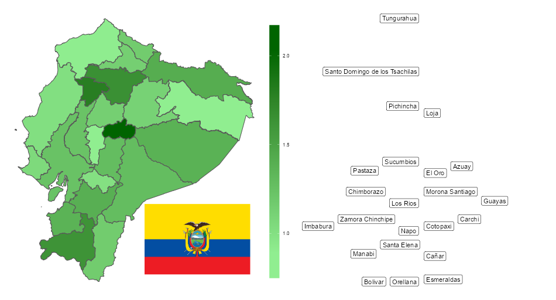

```{r global-options, include=FALSE}
knitr::opts_chunk$set(
  warning = FALSE,
  message = FALSE,
  include = FALSE
)
```

```{r libraries}
library(tidyverse)
library(sf)
library(patchwork)
library(ggrepel)
library(magick)
library(cowplot)
library(showtext)
library(knitr)
library(ragg)
```

```{r data-import}
# EPSG 4326
hospital_beds <- read_rds("ecuador_data.rds")


# remove Galapagos
hospital_beds <- hospital_beds %>%
  filter(NAME_1 != "Galápagos")
```

```{r import-fonts}
font_add_google("Roboto", "roboto")
```

```{r get-flag}
# get Ecuador's flag
ecuador_flag <- magick::image_read_svg("https://upload.wikimedia.org/wikipedia/commons/e/e8/Flag_of_Ecuador.svg", width = 350)

# image_write(ecuador_flag, path = "ecuador_flag.png", format = "png")
```

```{r plot}

# to add imported font automatically
showtext::showtext_auto()

plot_map <- ggplot(hospital_beds) +
  geom_sf(aes(fill = beds_per_1000)) +
  scale_fill_gradient(low = "lightgreen", high = "darkgreen", breaks = scales::extended_breaks(n = 3)) +
  theme_void() +
  guides(fill = guide_colourbar(
    nbin = 5,
    ticks = TRUE,
    direction = "vertical",
    barheight = unit(1, "npc"),
    title = NULL
  )) +
  theme(legend.position = "right")


plot_labels <- ggplot(hospital_beds, aes(x = -70, y = beds_per_1000, label = NAME_1)) +
  theme_void()

set.seed(42)
final_plot <- plot_map + plot_labels +
  geom_label_repel(min.segment.length = 50, direction = "x")

showtext::showtext_auto(FALSE)
```

```{r save-plot}
# Set up a device to save the graphic
ragg::agg_png("ecuador.png", width = 950, height = 512)

cowplot::ggdraw(final_plot) +
  cowplot::draw_image(
    ecuador_flag,
    x = .26, y = .32, width = 0.19,
    hjust = 0, vjust = 1, halign = 1, valign = 1
  )

# Turn the device off
invisible(dev.off())

# add caption in figure chunk
fig_caption <- "Number of hospital beds per 1000 people in the provinces of Ecuador (excluding Galápagos Islands). \n Notes: The left-hand side shows this statistic on the map; the right-hand side shows the names of the provinces, ordered along the y-axis by this statistic (the dispersion of labels along the x-axis has no inherent meaning, its only goal is to avoid overlapping labels)."
```

The number of hospital beds is an important measure of a country's health care system. In this post, I visualise this statistic in Ecuador. Country-level statistics are informative (available on the [WHO's website](https://www.who.int/data/gho/data/indicators/indicator-details/GHO/hospital-beds-(per-10-000-population))), but they might hide substantial variation within a country.

I wanted to find out if this is indeed the case in Ecuador, a geographically and culturally diverse country.

# Data

Ecuador is divided into 24 provinces (23 on the mainland plus Galápagos Islands). The data sources we need are as follows:

1.  Shapefiles for the provinces

2.  Number of hospital beds in each province

3.  Population in each province

The number of hospital beds is usually reported per 1000 people. I follow this convention here and calculate this statistic from (2) and (3).

# Visualisation

```{r show-plot, include = TRUE, echo=FALSE, out.width="100%", fig.cap=fig_caption}


```

# Lessons

There seems to be some variation in the number of hospital beds. I don't know, however, if this variation is large relative to other countries, or how much of it reflects real differences in health care standards.

<br>
<br>
*This post is part of the series "Around the world." In each post, I pick a new country, find an interesting (and publicly available) data set, and create a visualisation. My goals are to (1) learn more about a country, (2) understand a topic better, (3) and play around with visualisations. I publish the source code and all materials I used in the post on my [Github page](<https://github.com/danielbanki/daniel_banki>). I'm not an expert on most countries or topics, so please feel free to reach out if you have any feedback, suggestions, or corrections.*

```{r session-info}

sessionInfo()
```
