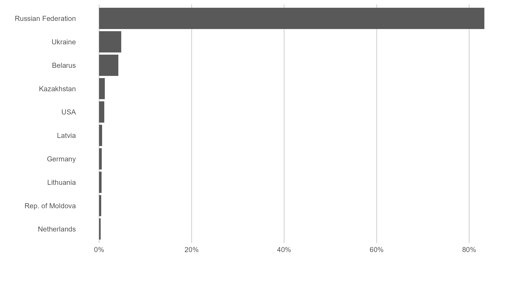
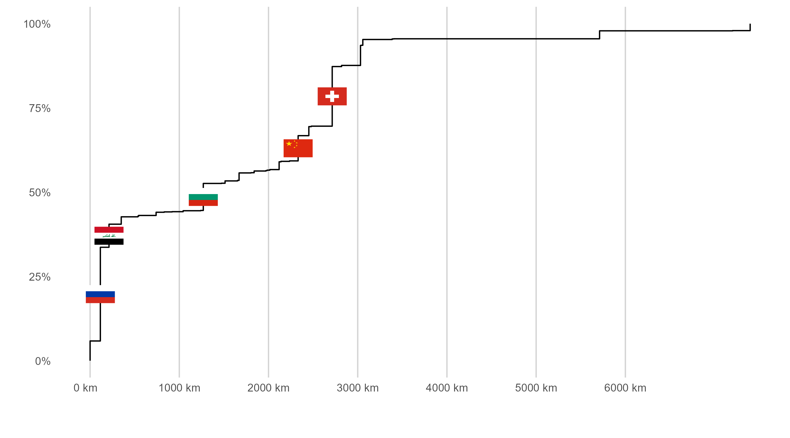

```{r global-options, include=FALSE}
knitr::opts_chunk$set(
  warning = FALSE,
  message = FALSE,
  include = FALSE
)
```

```{r packages}
library(tidyverse)
library(sf)
library(rnaturalearth)
library(magick)
library(ggimage)
```

```{r liquor-data-import}

liquor_exports <- read_csv("armenia-liquor-export.csv") %>%
  rename(trade_value = "Trade Value (US$)",
         partner_iso = "Partner ISO",
         partner = "Partner") %>%
  filter(trade_value > 10000 & partner != "World") %>%
  mutate(share = trade_value / 246241456,
         partner = as_factor(partner),
         partner_iso = as_factor(partner_iso)) %>%
  select(partner, partner_iso, trade_value, share) %>%
  drop_na()


liquor_exports_top10 <- liquor_exports %>%
  slice_max(trade_value, n = 10)
```

```{r liquor-prepare-plot}


ragg::agg_png("liquor-export-plot.png",
              width = 4 * 704,
              height = 4 * 391.2,
              res = 4 * 80)

ggplot(liquor_exports_top10, aes(fct_reorder(partner, share), share)) +
  geom_col() +
  coord_flip() +
  scale_y_continuous(labels = scales::label_percent()) +
  theme(
    plot.title = element_text(margin = margin(0, 0, 20, 0), hjust = 0.2),
    panel.background = element_rect(fill = "white"),
    panel.grid.major.x = element_line(colour = "lightgray"),
    axis.ticks = element_blank(),
    axis.title.x = element_text(margin = margin(20, 0, 0, 0), hjust = 0.35)
  ) +
  labs(x = "", y = "")

invisible(dev.off())
```

```{r world-data-import}
total_exports <- read_csv("armenia-all-export.csv") %>%
  rename(trade_value = "Trade Value (US$)",
         partner_iso = "Partner ISO",
         partner = "Partner") %>%
  filter(trade_value > 10000 & partner != "World") %>%
  select(partner, partner_iso, trade_value) %>%
  drop_na()

# calculate distances between Armenia and other countries
distances_all_countries <- rnaturalearth::ne_countries(returnclass = "sf")

indexes <- which(distances_all_countries$adm0_a3 %in% total_exports$partner_iso)

country_order <- distances_all_countries[indexes, "adm0_a3"]
st_geometry(country_order) <- NULL

sf::sf_use_s2(FALSE) # I added this line based on this:
# https://stackoverflow.com/questions/68478179/how-to-resolve-spherical-geometry-failures-when-joining-spatial-data

distances_matrix <- t(st_distance(distances_all_countries[6, ],
                                  distances_all_countries[indexes, ], ))

units(distances_matrix) <- NULL

joined_distances <- cbind(country_order, distances_matrix)

total_exports <- left_join(total_exports,
                           joined_distances, by = c("partner_iso" = "adm0_a3")) %>%
  mutate(
    distance_km = round(distances_matrix / 1000, 0),
    trade_1M_usd = round(trade_value / 1e6, 1)
  ) %>%
  select(-distances_matrix) %>%
  filter(trade_1M_usd >= 1) %>%
  drop_na() %>%
  arrange(distance_km) %>%
  mutate(
    cumsum_trade = cumsum(trade_1M_usd) / sum(trade_1M_usd),
    diff_from_last = cumsum_trade - lag(cumsum_trade)
  )
```

```{r formatting}

add_km <- function(x, ...) {
  format(paste0(x, " km"), ...)
}

asp_ratio <- 1.618
```

```{r get-country-flags}

# get country flags
file_paths <- list.files("./flags/", pattern = ".svg", full.names = TRUE)

svg_flags <- map(file_paths, image_read_svg)

png_names <- file_paths %>% str_replace(., "svg", "png")

png_flags <- svg_flags %>% map(~ image_convert(.x, format = "png"))

map2(png_flags, png_names, ~ image_write(.x, path = .y))

# -----------------------------------------------


text_data <- filter(total_exports,
                    partner_iso %in% c("BGR", "CHE", "CHN", "IRQ", "RUS")) %>%
  arrange(partner_iso) %>%
  mutate(flags_to_use = png_names)
```

```{r world-prepare-plot}

ragg::agg_png("world-export-plot.png",
              width = 4 * 704,
              height = 4 * 391.2,
              res = 4 * 80)

ggplot(total_exports, aes(x = distance_km, y = cumsum_trade)) +
  geom_step() +
  geom_image(data = text_data,
             aes(image = flags_to_use),
             nudge_y = -text_data$diff_from_last / 2,
             asp = asp_ratio,
             size = 0.04) +
  scale_y_continuous(labels = scales::label_percent()) +
  scale_x_continuous(breaks = seq(0, 6000, by = 1000), labels = add_km) +
  theme(
    plot.title = element_text(margin = margin(0, 0, 20, 0), hjust = 0.2),
    panel.background = element_rect(fill = "white"),
    panel.grid.major.x = element_line(colour = "lightgray"),
    axis.ticks = element_blank(),
    axis.title.x = element_text(margin = margin(20, 0, 0, 0), hjust = 0.35)
  ) +
  labs(x = "", y = "")

invisible(dev.off())
```

# Introduction

Some years ago, we were cleaning out the basement of a relative's house. Part of this task involved moving dozens of alcohol bottles that had been lying there, some of them for decades. They belonged to my grandfather, who had worked as a surgeon in Hungary in the second half of the 20th century. In those years, many patients expressed their gratitude to their surgeon after a successful operation by giving them gifts, including---among other things---home-grown produce and alcoholic beverages.

But what does this anecdote have to do with Armenia? Let me explain. Both Hungary and Armenia were part of [COMECON](https://en.wikipedia.org/wiki/Comecon), which was a trade bloc comprising the Soviet Union and countries in its sphere of influence. One of the most famous Armenian products imported to Hungary at the time was a brandy called [Ararat](https://en.araratbrandy.com/).

As such, my grandfather almost certainly received some bottles of it over the years, and on the day of the cleanup maybe even I was casually placing a decades-old Ararat brandy into a wooden crate. Memories fade, and we will probably never know if there was one in the pile that day. What we can know, however, is how Armenia's brandy export looks today.

# Brandy exports

Ideally, I would have liked to focus on exports of only the brand Ararat, but I didn't find any data on their sales. So I looked up Armenia's exports in that product category (TARIC/HS code 220820---a classification system used in international trade; data from [here](https://comtrade.un.org/data/)). These were the top 10 countries to which Armenia exported its brandy in 2019:

```{r liquor-caption}

liquor_export_caption <- "Top 10 countries to which Armenia exported brandy in 2019. The x-axis shows each country's share of Armenia's brandy export, as measured by the USD value of the export."

```

```{r show-liquor-plot, include=TRUE, echo=FALSE, fig.cap=liquor_export_caption}

```

The figure shows that the overwhelming majority of Armenia's brandy exports were to Russia. Another thing I found notable is that 7 of the top 10 countries were formerly part of the Soviet Union. Past trading relations, geographical proximity, and Russian as a common language probably explain much of this figure. But brandy exports may be atypical in many ways (e.g., many countries in the region are Muslim-majority countries that don't import alcoholic beverages), so I wondered whether Armenia had the same export partners in other product categories as well. 

# Total exports

In the second visualisation, I thus focus on total exports and show what percentage of them went to countries within a given distance.

```{r world-caption}

world_export_caption <- "Cumulative share of Armenia's total exports in 2019 for a given distance. The x-axis shows the distance between Armenia and other countries, measured as the smallest distance between the two borders. A vertical segment denotes a country to which Armenia exported. The length of the vertical segment is the country's share. The top 5 countries to which Armenia exported in 2019 are shown by their flags (from left to right: Russia, Iraq, Bulgaria, China, and Switzerland)."

```

```{r show-world-plot, include=TRUE, echo=FALSE, fig.cap=world_export_caption}

```

We see that half of the total exports went to countries that are within 1200-1300 kilometers, and almost 100% of exports went to countries within 3000 kilometers. A technical note: the distance between two countries is calculated using the shortest distance, this is why a large country like Russia is shown as being only around 100 kilometers away from Armenia. Even with this limitation in mind, it seems that Armenia mostly exports to countries that are not too far away. Is this true for most countries, or do the types of products Armenia exports (e.g., products that are difficult or expensive to transport) have something to do with this?

If we consider Armenia's top 5 export partners across all export categories (in descending order by export volume: Russia, Switzerland, Bulgaria, China, and Iraq), we don't see much of an overlap with our list on brandy exports. Not only that: the top 5 export partners don't seem to form any obvious geographical, linguistic, or cultural clusters. Nor does Armenia seem to export similar products to them. For example, it mostly exports tobacco-related products to Iraq, alcoholic beverages to Russia, and copper and other minerals to Switzerland. As before, is this pattern similar in other small countries, or are there some historical reasons that are specific to Armenia?

# Credits

-   Data from the [UN Comtrade Database](<https://comtrade.un.org/data/>)

-   Flag icons from [here](<https://github.com/lipis/flag-icons>)

-   Distances between countries from [Natural Earth](<https://www.naturalearthdata.com/>) via the `rnaturalearth` package


```{r session-info}

sessionInfo() %>% capture.output(file = "session_info.txt")
```


```{r}

disclaimer <- paste0("../../_disclaimers/around-the-world-disclaimer.Rmd")


```

```{r disclaimer, child = disclaimer}


```
