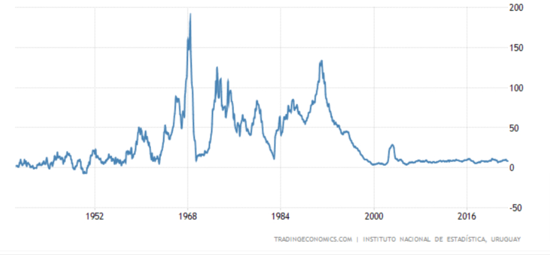
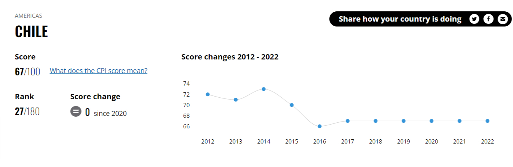

A systematic approach to learning is great.
But sometimes we need a bit of randomness to deviate from our preconceived notions and explore topics we may not have considered otherwise.
In this post, I experimented with this combined approach: I visited the official websites of three Latin American capitals (systematic part) and browsed aimlessly until I bumped into something interesting to write about (random part).

# Montevideo

It's a bit concerning to be only one click away from the [traffic violations page](https://montevideo.gub.uy/areas-tematicas/movilidad/fiscalizacion-de-infracciones/costos-de-las-multas) on a city's website.
Such ease of access suggests that the page is visited quite frequently---and probably not to meticulously study all possible rules and fines before a casual drive.
So, what can get you in trouble on the streets of Montevideo?

The list is alarmingly long, with 180 to 200 items.

But before we give in to despair, let's focus on something neutral first: the fines are expressed not in Uruguayan pesos but in something called UR (Unidad Reajustable).
This is a unit of account that corresponds to a given number of pesos and is periodically adjusted based on the inflation rate.
For example, the fine would always be 5 UR, but this might correspond to 1350 pesos in January and 1400 pesos in February.

We would expect such a unit of account in a high-inflation environment.
But there wasn't particularly high inflation in Uruguay in the last 20 years or so.
Why have the UR then?

If we look at the chart below, we see that inflation reached [very high levels in 1968](https://tradingeconomics.com/chile/inflation-cpi).
Not coincidentally, the UR unit was introduced the same year.
Even though it seems to have lost its purpose over time, it's difficult to get rid of something that has been around for half a century.
Beyond the usual status quo bias and inertia, some financial instruments like pensions or mortgages might be denominated in UR, which makes changing the current system politically sensitive.

After this detour, let's look at a non-exhaustive list of things you are not supposed to do while driving in Montevideo.

You can get fined, among other things, if you follow another vehicle more closely than is reasonable or prudent, reverse unnecessarily, drive at a low speed that obstructs traffic, stop or park in a way that causes danger, open the traffic-facing door of your car without reason or leave the door open for longer than necessary, park in a way that's not parallel to the curb, signal a turn without actually turning, increase your speed while another vehicle is overtaking, or have a motorcycle with handlebars more than 40 centimetres from the seat.
(For the detail-oriented, the full list is available [here in a PDF](https://montevideo.gub.uy/sites/default/files/biblioteca/listadodeinfraccionesycostos.actualizacion23-2-22.pdf).)

Some rules make sense and set driving standards that good drivers should aspire to.
This doesn't mean, however, that high driving standards should be enforced by fines and, ultimately, the threat of force.
But some other rules seem outright arbitrary, overly broad, and subjective.
For instance, who is to judge if your driving slowly obstructed traffic or was the cautious thing to do?
And how about that car door that the inspector thinks could have been closed a bit more hurriedly?

Fining people based on a vaguely defined rule is likely to decrease people's trust in the rule of law and the fairness of the system.
But if having one vaguely defined rule is bad enough, then having tens of them questions the legitimacy of traffic enforcement.
It almost looks like it's impossible to go for a 10-minute drive in Montevideo without inadvertently committing at least a few traffic violations.

The point is not that Montevideo is a worse offender than other cities.
It probably isn't.
It's like all the other cities that have laudable aspirations but bad outcomes.
They don't realize that the cumulative effect of the mainly sensible-looking individual rules is frequently an arbitrary and unjust legal environment.

# Buenos Aires

The website of Buenos Aires seems to focus heavily on administrative procedures.
Most of them are routine, run-of-the-mill procedures like how to get your driver's license or how to register the birth of your child.
But not all: In Buenos Aires, you can sign your [marriage paperwork in emblematic places](https://buenosaires.gob.ar/tramites/reserva-de-turno-para-matrimonio-en-lugares-emblematicos), rather than in a depressing government building.

You can book one of 13 emblematic places for the occasion, mainly museums and some parks.
This offering seems to skew somewhat towards the culturally minded, and its price tag of about 24 000 Argentine pesos (or 65--130 USD) probably makes it too expensive for some locals.

Although I have no way of checking the availability of the various venues, I suspect that if people were indifferent between them, the current offering (of 13 venues) would be sufficient to host all marriage ceremonies.

Let's check this assertion with a quick back-of-the-envelope calculation.
In 2019, there were around [11 000 marriages in the city](https://es.statista.com/estadisticas/1238351/numero-de-matrimonios-registrados-en-argentina-provincia/).
If we assume that every second couple wants to get married in one of these places, which is almost certainly an overestimate, then we would have 5500 couples a year overall or fewer than 500 marriages per venue.
Holding 8--10 ceremonies a week per venue sounds more than feasible.

Another matter altogether is whether all emblematic places are equally desirable.
The answer is very likely no.
An open-air venue like a nice park is likely to attract more couples than a niche museum of contemporary Argentinian art.
This way, the relevant supply of emblematic places is probably much smaller than the theoretical supply.
So, it might be the case that you can get married at an emblematic place---so long as you choose one not many other couples are interested in.

So, having unusual and shared preferences as a couple---like an affinity for Argentinian art---likely confers certain advantages at the time of marriage and, hopefully, beyond.

# Santiago

## Bottled gas

On the city's homepage, a prominently displayed banner advertises a [deal between the city and gas companies](https://www.munistgo.cl/gas/).
City residents get a roughly 15% discount on their bottled gas purchases.
At first, I didn't understand why such a niche measure would be featured so prominently on the city's website.
Then I realized: bottled gas is not so niche in Chile as in the places I'm more familiar with.

In Chile, there are approximately [6.5 million homes](https://www.ine.gob.cl/estadisticas/sociales/censos-de-poblacion-y-vivienda), 5.4 million of which rely on bottled gas for things like cooking, heating water, or heating their homes.
The average home's yearly bottled gas consumption is around 2000 KWh, or around 150 kg (details [here](https://www.energia.gob.cl/sites/default/files/documentos/informe_final_caracterizacion_residencial_2018.pdf) in a PDF).
With the 15-kg cylinder being the most common container, this means 10 refills a year.
If you are a politician, every refill can be a good opportunity to remind the electorate who is to thank for the discount.

## Ley del Lobby

In 2014, Chile introduced a transparency law called Ley del Lobby.
The stated objective of the law was to increase transparency and accountability.
The law, among other things, forces public office holders to report the details of every gift they get, every meeting they have with lobbyists, and all the travelling they do.

Transparency is great, and there should be more of it.
So, laws that promote more transparency should, in principle, be welcomed.
But this doesn't relieve us of the obligation to ask the age-old question: Do these laws achieve their stated objective, or do they merely create an extra administrative burden, or worse yet, create unintended consequences?

There are many reasonable ways to measure transparency.
One of them is the Corruption Perception Index, which measures people's perception of public sector corruption in their country.

According to this measure, [Chile is doing well in absolute terms](https://www.transparency.org/en/cpi/2021/index/chl).
But the question we are interested in here is whether there has been a positive change (i.e., a higher score) since the law was introduced in 2014.
Well, if there has been, the index doesn't pick it up.

This doesn't mean that the law didn't make anything better.
All the usual disclaimers apply: maybe the score would have been worse in the absence of this law, maybe the law improved something relevant not measured by the index, maybe the index is not very reliable in the first place, etc.
Just looking at this small piece of evidence, however, seems to suggest that this law probably didn't make much of a difference.

Even if the law doesn't achieve its stated goals, it can certainly do one thing: provide a bit of entertainment.

As an illustration of how the law is implemented, here's a list of some of the [gifts Irací Hassler, Santiago's mayor, declared since 2021](https://www.leylobby.gob.cl/instituciones/MU308/cargos-pasivos/389774/donativos):

-   A notepad from a neighbourhood organisation.
    It's a shame we don't learn whether it was a lined or a graph paper notepad.

-   Embassies seem to have been especially generous.
    The Swiss Embassy gave her a pick-up sticks game called Mikado, the Japanese Embassy a calendar (in two consecutive years, no less), and the UAE Embassy a box of dates.

-   A constituent sent her prescription glasses (2 pairs, to be precise).
    The mayor was also the lucky recipient of a personalized stuffed toy, a 400-gram package of red quinoa, and a 16-gram sachet of oregano.

Zooming out of this concrete case, I find it interesting that there seem to be no high-value gifts in these declarations. I can think of three possible explanations for that. First, public office holders didn't receive high-value gifts even before the law. Second, they used to receive high-value gifts but they no longer do because of the new law. Third, they receive high-value gifts, but they don't report them.

To the extent that high-value gifts are undesirable (i.e., they are considered a form of bribery), the law would have the desired effect if it stopped people from giving high-value gifts to office holders.
Unfortunately, we can't adjudicate this claim based on the information contained in these declarations since, by definition, we cannot observe the gifts office holders don't declare.
